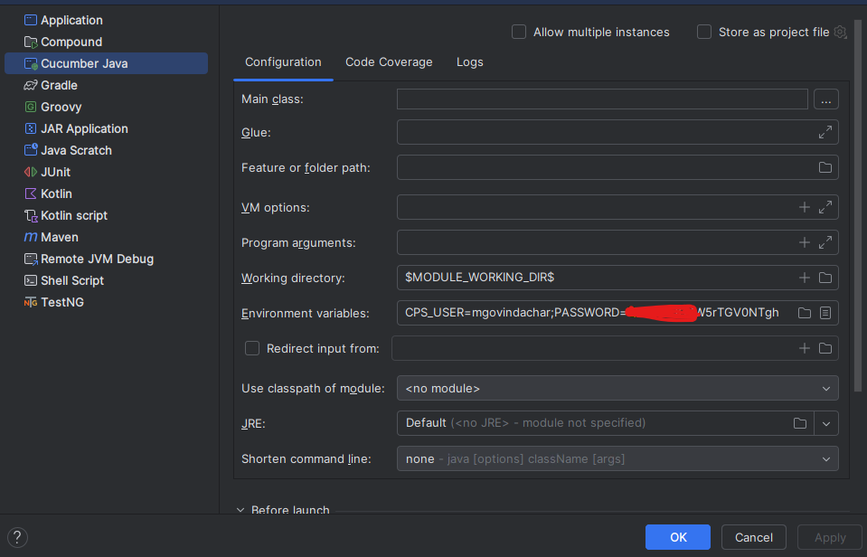

# E2E Testing Framework with Cucumber

CPS E2E testing framework built with **Java**, **Maven**, **Cucumber PICO container**, and **RestAssured**.
It allows writing readable and maintainable test scenarios for REST APIs.

---

## Getting Started

### Prerequisites

- Java 25
- Maven 3.9.12
- IDE (IntelliJ)

---

## Project Structure

### Folder Descriptions

- stepdefs: Contains Java methods that map to Gherkin steps.
- runners/: Holds the Cucumber test runner classes (e.g., using JUnit).
- utils/: Utility classes for config management, API requests, etc.
- features/: Contains .feature files written in Gherkin syntax.
- .env.*: Environment-specific variables for API base URLs, tokens, etc.
- pom.xml: Maven dependencies and build configuration.

---

## How to Run Tests

### Using Intellij
Generate encoded password using SecurePassCode.class 

Create intellij cucumber default configuration
Edit run configuration --> Edit Configuration Template --> Cucumber Template 



NOTE:- CPS_USER should not be added with .CIN3 or .CIN5

#### UI tests limitations
```
all the tests should be tagged with @ui, else browser instance won't get created
New page is created, newly created page reference needs to added in Pages.class
TWIF cases uses messaging up, for now run locally instructions are found Link https://dev.azure.com/CPSDTS/Information%20Management/_git/Cps-Police-Message-Simulator-Api?path=/README.md

``` 

#### How to record UI tests using playwright java

```
npx playwright codegen --target=java
```

### Using Maven

To execute all Cucumber API tests, run the following command from the project root:

##### run with default setting
```
mvn clean test -DargLine="--enable-native-access=ALL-UNNAMED"  //Enables native access to suppress Java 17+ warnings
```

#### Run tests in msedge, headless mode, with tracing and video in QA:
```

mvn clean test -Denv=qa -Dbrowser=edge -Dheadless=true -Dtracing=true -Dvideo=true

```

#### Cucumber tags 
```
mvn clean test -Dcucumber.filter.tags="@ui and @api"
mvn clean test -Dcucumber.filter.tags="not @ui" // not ui tests
```

### Rebasing and Merging Your Branch into `develop`

To integrate your feature branch into the `develop` branch with a clean history and **without force pushing**, follow these steps:

###  Steps

#### 1. Switch to your feature branch
git checkout your-branch-name

#### 2. Rebase your branch onto the latest develop
git rebase develop

#### 3. Switch to the develop branch
git checkout develop

#### 4. Merge your branch (fast-forward if possible)
git merge your-branch-name

#### 5. Push the updated develop branch to remote
git push origin develop


### Authors

Maintainer and contributor to the E2E testing .


- **Arvin Thoom** – QA Tester
- **Murali Govindachar** – QA Tester
- **Venkata Mannepalli** – QA Tester
- **Patrick Obiaso** – QA Tester

---


